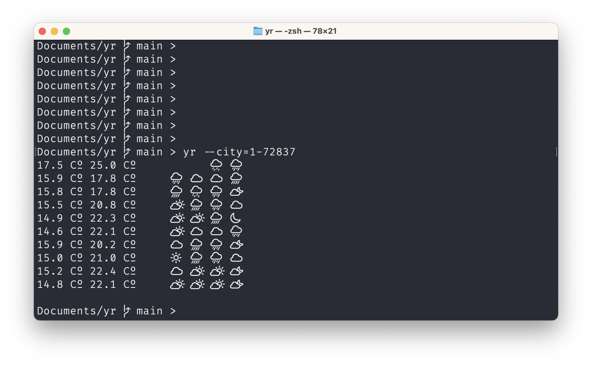

# Just a CLI for yr.no weather forecasts




## Requirements

It works best if your console font supports weather symbols like these:  􀆭  􀇆  􀇔

## Running

This shows the weather in Berlin
```
unorsk~: yr --city=2-2950159              
26.8Сº  0.0mm   􀆭  􀆭  􀆭
```

## Installation (building from source)

```
cabal install yr
```
or if you rebuilding it
```
cabal install yr --overwrite-policy=always
```